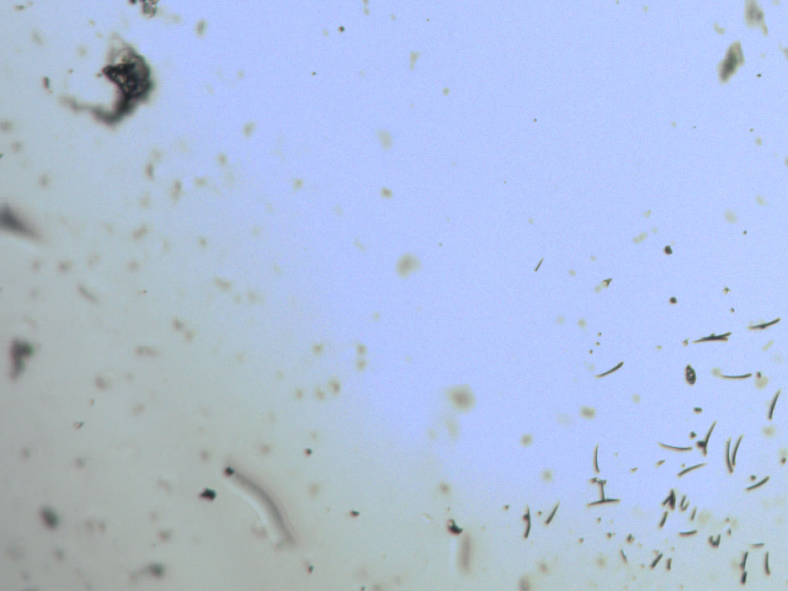
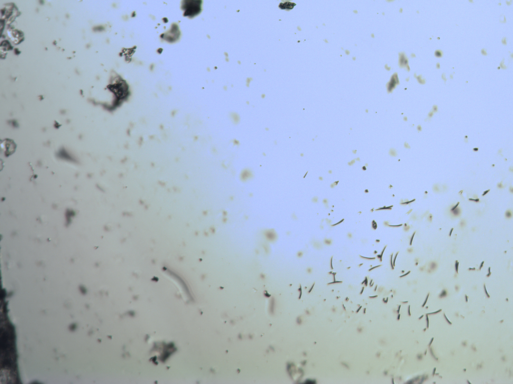

# Current-main Apple Silicon optical regression

Date: 2026-10-04

The exact public commit `72964bb608102fa82232a8de966189219ec4309c`, after
the full-resolution Linux V4L2 work was merged, was rebuilt on the Apple
Silicon workstation and exercised against the directly connected physical
`0547:c003` microscope camera. The microscope was illuminated and viewing dust
and debris on a glass plate.

## Native dependency selection

The workstation also has an old Intel Homebrew tree under `/usr/local`. Its
default `pkg-config` selected an `x86_64` libusb, which an ARM64 linker
correctly rejected before any USB operation. Pointing the unchanged build at
native ARM64 libusb package metadata produced an ARM64 reader, and the complete
project test suite passed.

The public Makefile and README now expose a scoped
`LIBUSB_PKG_CONFIG_PATH=/path/to/native/lib/pkgconfig` override so this common
dual-Homebrew case does not require changing the user's global environment.
A deterministic camera-free test verifies that the override reaches both the
libusb compiler-flag and linker-flag queries.

## Physical capture

Both modes used a requested 250-ms exposure and gain 0. Each command exited
zero, reported `status=ok`, applied both controls, discarded one pre-control
buffered record, preserved the exact first device record, and wrote one
monotonic timestamp per accepted Bayer frame.

| Mode | Geometry | Frames | Bytes per Bayer frame | Delivered cadence | First-frame mean / p01 / p99 | Zero / saturated pixels |
| --- | --- | ---: | ---: | ---: | --- | ---: |
| 2 | 1280x960 | 3 | 1,228,800 | 9.51334 fps | 178.264 / 79 / 220 | 0 / 0 |
| 0 | 3664x2748 | 2 | 10,068,672 | 2.75318 fps | 169.355 / 58 / 220 | 0 / 0 |

Mode 2 intervals were 105.088 and 105.143 ms. The two mode-0 frames were
363.217 ms apart. All five Bayer frame hashes were distinct. The first-frame
SHA-256 values were:

```text
5a93ee5c57db63eb838bf30596aaf8e16169a2cf317c3b3446b5163b577ccbcb  mode 2
a45d57f10e6f11d0827e05bbd97998bf675786ca5f381115fcd49d8eed2cb67e  mode 0
```

## Rendered evidence

The following JPEGs are public display derivatives of the retained lossless
renders. FFmpeg used the project's provisional GRBG interpretation and the
previously measured tungsten-field ratio `R:G:B = 0.87:1.0:2.0`. The color is
therefore illustrative, not a final Bayer-phase or colorimetric calibration.
Select either image to open its complete published dimensions.

[](images/current-main-mode2-optical.jpg)

*Mode 2: 1280x960 preview frame.*

[](images/current-main-mode0-optical.jpg)

*Mode 0: complete 3664x2748 full-resolution frame.*

Both images show the same coherent dust field over the full raster. The native
mode-0 frame contains more scene detail and has neither the historic
half-frame black boundary nor the later corrected edge strip. The field is
still brighter toward the centre, consistent with the documented optical
illumination gradient.

Published JPEG hashes are:

```text
db5eb1d3a6a00b52012daaf29765956827aac4b267b35e3041b8b2a206e5e53c  mode 2 JPEG
49c4d0403e69af2906f341598d8f0070eea1edea7e511246633fdd9ff9043e64  mode 0 JPEG
```

## Acceptance effect

This physically regresses the exact public post-V4L2-merge reader on Apple
Silicon and confirms complete, changing, coherent optical frames in both
supported sensor modes. It does not substitute for the pending physical Linux
V4L2 application run, a true blocked-light dark and translated flat-field
session, cable reconnect, or known-color-target calibration.
