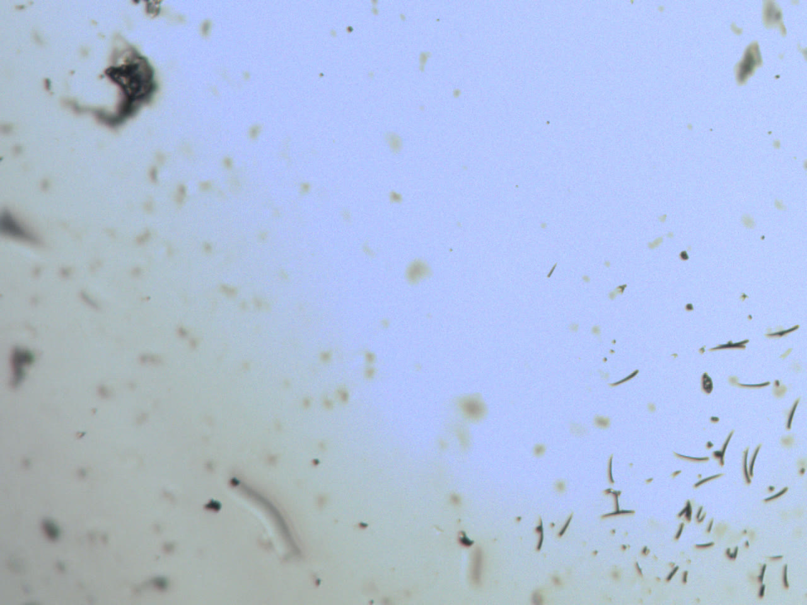
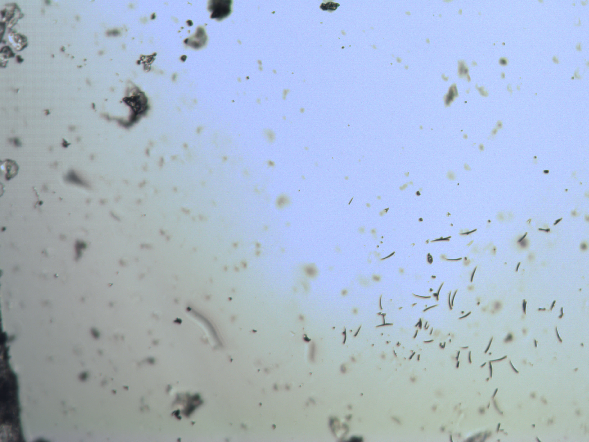

# Public prerelease `v0.2.0-alpha.8`

Date: 2026-10-04

## Result

The annotated public tag `v0.2.0-alpha.8` resolves to commit
`2dd0b395e033d0a68410ac03e5b549ea534caeac` and is published as a GitHub
prerelease:

<https://github.com/la3lma/tucsen-tca-camera/releases/tag/v0.2.0-alpha.8>

This release packages the complete 1280x960 preview and 3664x2748
full-resolution Linux V4L2 application paths, separate producer and consumer
evidence, camera-free lifecycle/backpressure coverage in both geometries, the
independently runnable uncorrected physical transport gate, strict map-backed
corrected delivery, a recorded application deadline with deterministic
cleanup, the post-merge Apple Silicon optical regression, and Docstack 4.2.
The implementation remains Apache-2.0 licensed and entirely in user space.

## Independent verification

- Exact commit `2dd0b39` passed GitHub CI on Ubuntu and macOS before tagging:
  run <https://github.com/la3lma/tucsen-tca-camera/actions/runs/37206136495>.
- The tag itself passed a separate GitHub CI run on Ubuntu and macOS:
  run <https://github.com/la3lma/tucsen-tca-camera/actions/runs/37206242284>.
- A detached exact-commit worktree on Raspberry Pi AArch64 passed
  `make clean && make test`. This run was USB-inert because the camera remained
  attached to the Mac.
- The GitHub tag archive was downloaded inside the private report project,
  extracted outside a Git checkout, and passed the complete Apple Silicon
  suite using the documented scoped native-ARM64 libusb `pkg-config`
  override. Its SHA-256 is
  `9772b437d2e5371857a257c11e0c3b4ff88de0ee9d64c754c8d4fcabb0e40d60`.
- The host's default `pkg-config` still selected a stale Intel Homebrew libusb
  and failed to link for ARM64. Re-running with the release's documented
  `LIBUSB_PKG_CONFIG_PATH` override selected the project-local native library
  and passed. This independently exercises the mixed-Homebrew recovery path.
- The release commit passed the full-history public publication audit. The tag
  and release contain no raw disassembly, decompiler export, Ghidra project,
  vendor binary, firmware, packet capture, VM disk, or private-work artifact.

## Exact-tag physical regression

After publication, the downloaded alpha-8 source archive's native ARM64
reader was run directly against the Mac-attached physical microscope camera.
Both modes used requested 250 ms/gain 0 and returned `status=ok` with exact
device-record, Bayer-stream, and timestamp-row counts.

| Mode | Geometry | Frames | Exact Bayer bytes | Delivered cadence | First-frame mean / p01 / p99 | Zero / saturated |
|---|---:|---:|---:|---:|---:|---:|
| 2 stable repeat | 1280x960 | 10 | 12,288,000 | 9.50216 fps | 178.367 / 79 / 220 | 0 / 0 |
| 0 | 3664x2748 | 2 | 20,137,344 | 2.75115 fps | 169.465 / 58 / 220 | 0 / 0 |

Preview intervals were 104.778–105.432 ms with p50 105.296 ms; the
full-resolution interval was 363.485 ms. All ten preview and both
full-resolution hashes were distinct. The first-frame hashes were:

```text
59ed9202d821b70db61267bc553e43ab0213b6969c2aa628a58a537c54066a26  mode 2
a1e8ce87d3438129b0ac9fb29774bac489e0284b40446afffc027073ba3f2009  mode 0
```

The first short three-frame preview session was optically valid but had a
429.728-ms interval followed by 74.563 ms. The immediate ten-frame repeat was
stable. This is retained as a start-of-session cadence transient; the physical
Linux run must likewise preserve and report startup behavior rather than hide
it.

The following JPEGs are display derivatives of retained lossless renders.
They use provisional GRBG and the earlier neutral-field multipliers, so their
color is illustrative rather than a final phase/color calibration.

[](images/alpha8-mode2-optical.jpg)

*Exact alpha-8 mode 2: 1280x960 preview.*

[](images/alpha8-mode0-optical.jpg)

*Exact alpha-8 mode 0: complete 3664x2748 full-resolution raster.*

Both renders show the same coherent dust field. Full resolution contains more
scene detail and has neither the historic half-black boundary nor an edge
strip. Published JPEG hashes are:

```text
dc1276f8b6b980e0526f402d87e0b967766a107cdfccd8000fd51c82fd41b416  mode 2 JPEG
28762dbd5b436404667168d6a50f8c000f2181cd393b877089a6d6ba4fbed541  mode 0 JPEG
```

This closes a physical regression of the exact public tag on Apple Silicon.

Camera-free Raspberry Pi runs exercised the real V4L2 bridge at both
application geometries with consumer detach/reattach, deliberate delayed
consumption, bounded post-warm-up process-tree memory, exact output bytes and
digests, deterministic termination, and complete device/module cleanup.

## Explicit residual gates

This is a useful prerelease, not final acceptance. The remaining physical work
is:

1. move the camera to the Raspberry Pi and execute the explicitly uncorrected
   preview and full-resolution V4L2 application gates;
2. acquire true blocked-light dark and translated/defocused blank-field flat
   sets at locked settings, then repeat the physical V4L2 gate with the
   accepted map;
3. confirm Bayer phase, orientation, and color response with a known target;
   and
4. complete the physical cable disconnect/reconnect acceptance case.

AVFoundation/system-wide macOS camera discovery remains a non-blocking
deferral; the direct portable reader continues to work on macOS.
